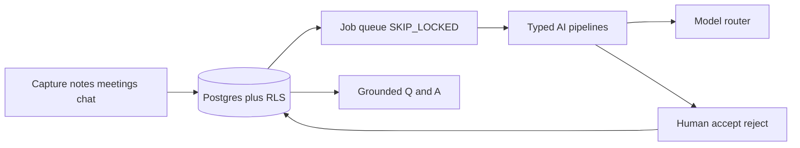
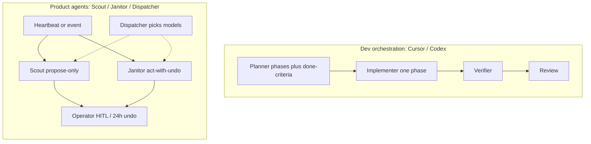

# Hive-demo

This repository is a reconstruction of an internal ops system called Hive I designed and shipped. 

**Demo video: COMING SOON**

Runnable reconstructions (fake fixtures only): `[examples/recency-retrieval.ts](examples/recency-retrieval.ts)`, `[examples/eval-harness.ts](examples/eval-harness.ts)`, `[examples/rls-allowlist.sql](examples/rls-allowlist.sql)`.

---

## Thesis

I was working on our company brain / knowledgebase / OS.

Hive's job is basically: capture operator state, propose next actions with a human in the loop, and answer questions only from that state. In-platform retrieval only, and only grounded with citations.

## Architecture that follows

- **One TypeScript monolith**: Next.js + Postgres, so retrieval, RLS, jobs, and UI share types and one deploy.
- **AI as typed pipelines with evals**.
- **Agents with explicit blast radius**. A heartbeat is a *trigger*. Authority is a separate bit (`propose_only` vs `act_with_undo`).
- **Invite-only security**: email allowlist, app role, Postgres RLS. Service role stays off the user-facing path; the caveats are in [decision 3](#3-rls-threat-model-invite-only-team).

### Data and AI flow




Capture lands in Postgres. A `SKIP LOCKED` job queue feeds typed pipelines through a model router. Pipelines propose; a human accepts or rejects; accepted writes go back to state. Grounded Q&A reads the same tables. There is no second brain.

### Two loops I used

1. Shipping the code using sub-agentic infra
2. Shipping the actual agentic infra inside the platform




---

## Four decisions

### 1. Dev orchestration loop vs product agents

A trigger can fire without write access. Authority is a separate bit.

The dev loop (planner -> implementer -> verifier -> review) is how I shipped the code. Phases have done-criteria. The verifier does not share the implementer's context window. SDLC-for-agents: *how we build*.

The product loop is heartbeats and jobs, each with an authority bit:


| Agent      | Authority       | What it may do                                                         |
| ---------- | --------------- | ---------------------------------------------------------------------- |
| Scout      | `propose_only`  | Surface a card. Never create work.                                     |
| Janitor    | `act_with_undo` | Auto-dismiss stale items at confidence above 0.7, with a 24-hour undo. |
| Dispatcher | none (routing)  | Pick a model.                                                          |


A bounded `runAgentLoop` (plan -> act -> observe) exists as foundation and tests. It stays off Scout, Janitor, and grounded Q&A. Executable tools were a fast-follow.

### 2. First-party TypeScript pipelines

The stack is Anthropic + OpenAI + Zod inside the Next.js app, because:

- **Same language across the stack:** Types, Server Actions, and evals import the same ranking functions the app uses.
- **Forced-JSON pipelines:** until a write is human-gated
- **Explainable routing**: candidates, complexity class, circuit breaker, persisted run rows.

HITL write + struct output: a router, a schema, and a golden file.

### 3. RLS threat model: invite-only team

Threat model: trusted teammates on a shared ops database.

1. Email allowlist (`allowed_users`): invite-only; auth is not enough.
2. `current_app_role()` from that row: operator vs admin.
3. RLS on every table, plus an edge gate that re-checks on the layout.

Sketch: `[examples/rls-allowlist.sql](examples/rls-allowlist.sql)`.

**Caveats in the product to catch:**

- Many operational tables use `USING (true)` for `authenticated` - shared across the team; no row-owner isolation.
- Some Server Actions elevate to **service role after an application-level auth check**. For those writes the trust boundary is app code. Service role stays off the user-facing client path.
- Allowlist timeouts fail open; the layout re-checks.

### 4. Recency vs similarity retrieval

Similarity RAG fails "last meeting with Avery" when an older, wordier note ("Coach Avery weekly...") outranks a short newer "Avery 1:1". Cosine does not know Tuesday.

The fix (reconstructed in `[examples/recency-retrieval.ts](examples/recency-retrieval.ts)`):

1. Detect **temporal intent** (`last`, `latest`, `most recent`).
2. **Name-gate** so you only rank rows that mention the person.
3. Rank **date-first**.
4. **Skip the similarity merge** so lexical overlap cannot resurrect the wordy record.

"what did Avery say about pricing" is a topic question, so we still rank by overlap. Date-first only kicks in for last / latest, and there's an in-platform retrieval only.

---

## Honesty

Evals cover the **core loop**: intake-shaped goldens, grounded Q&A, a few operator situations. A lot of pipelines have no suite, and the promotion gate is schema and fingerprint.

Scout does not execute. `runAgentLoop` stays off the product path. The claim I care about is grounded state plus explicit authority.

---

## How to read this repo


| File                                                             | Why it exists                                                                                                                                         |
| ---------------------------------------------------------------- | ----------------------------------------------------------------------------------------------------------------------------------------------------- |
| `[examples/recency-retrieval.ts](examples/recency-retrieval.ts)` | Temporal intent, name-gate, date-first, similarity veto. Newest Avery 1:1 wins; pricing stays overlap-ranked. `npx tsx examples/recency-retrieval.ts` |
| `[examples/eval-harness.ts](examples/eval-harness.ts)`           | Golden JSONL + Zod; schema vs live; three fake goldens; pass/fail summary. `npx tsx examples/eval-harness.ts`                                         |
| `[examples/rls-allowlist.sql](examples/rls-allowlist.sql)`       | Allowlist; role helper; SELECT self / admin-all. Team-shared RLS.                                                                                     |


```bash
npm install
npx tsx examples/recency-retrieval.ts
npx tsx examples/eval-harness.ts
```

